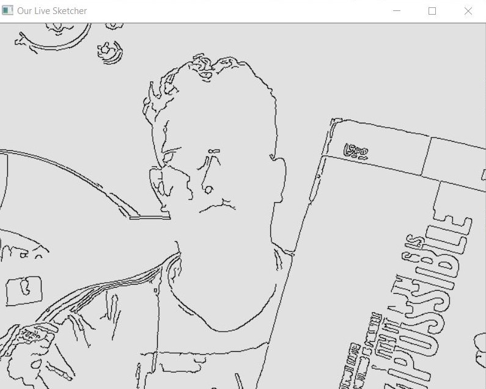

# opencv-sketcher
A live sketcher built using OpenCV.

You need to install Python version 3.7 and opencv library to run this program.

Snapshots of the window frames are given below:-

** Original Frame**

** Sketcher Frame **

